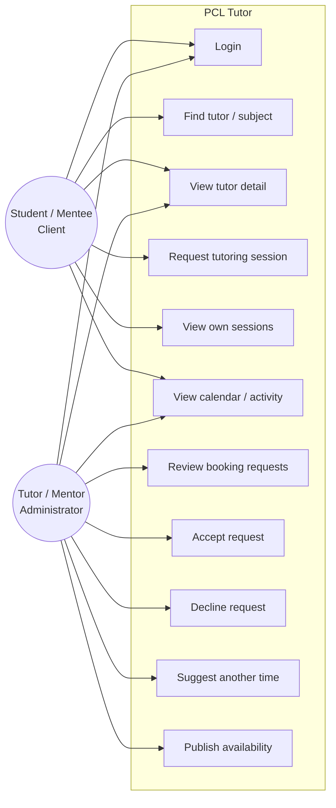
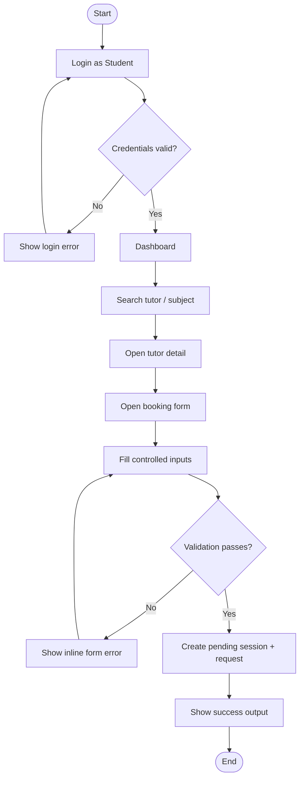
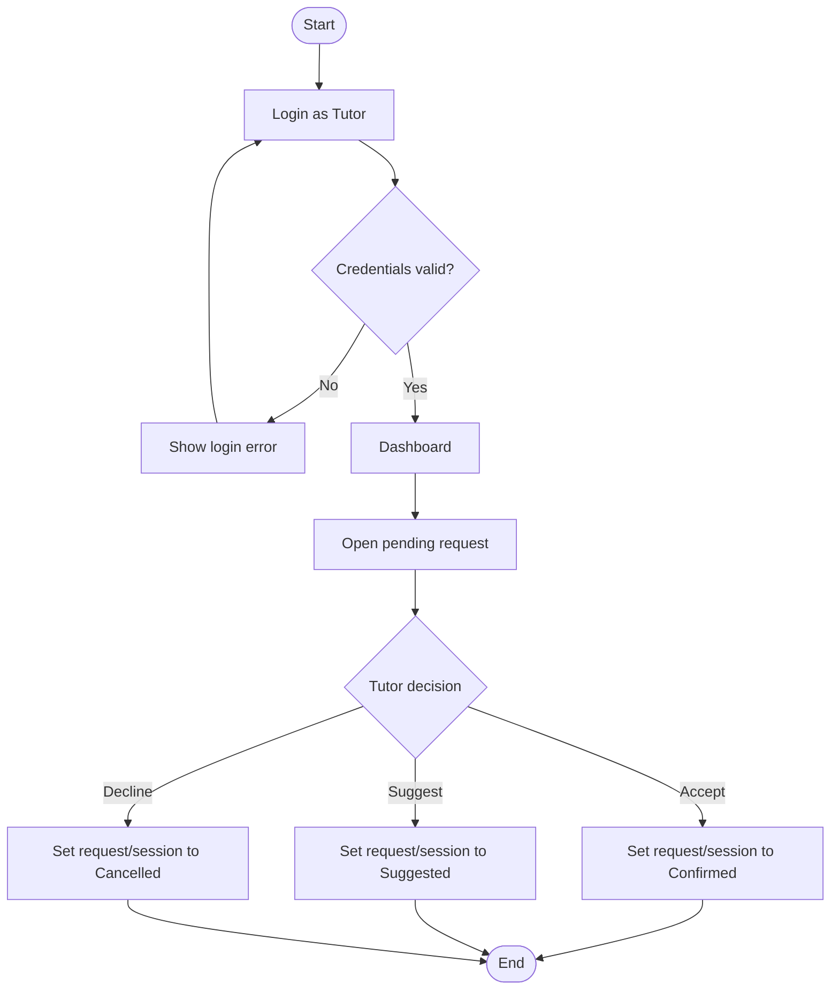

# PCL Tutor — Practice Centered Learning | Midterm Software Design Modeling

> **Rubric mapping:** the UI calls the two roles **Student / Mentee** and **Tutor / Mentor**. For the course rubric, Student/Mentee is the **Client** and Tutor/Mentor is the **Administrator/service provider**. The midterm still has exactly two roles.

## 1. Project description
PCL Tutor (Practice Centered Learning) is a peer tutoring web application for AI students. A student can search a tutor by tutor name or AI subject, inspect a tutor's profile and availability, and request a study session online or offline. A tutor can review incoming requests, accept, decline, suggest another time, and publish availability. The midterm uses hardcoded frontend data only.

### Problem
The existing course platform is useful for course delivery but is not a focused peer-tutoring workflow. PCL Tutor narrows the experience to one task: **find the right peer tutor, understand their schedule, and request a session without a crowded interface**.

## 2. Actors / goals
| Actor in app | Rubric role | Goal | Main access |
|---|---|---|---|
| Student / Mentee | Client | Find and request tutoring | Search, tutor detail, booking form, own requests/sessions, calendar/activity |
| Tutor / Mentor | Administrator | Offer tutoring and manage requests | Tutor dashboard, request actions, availability form, sessions, calendar/activity |

## 3. Permission matrix
| Feature / page | Student / Client | Tutor / Administrator |
|---|:---:|:---:|
| Simulated login | ✓ | ✓ |
| Main menu / dashboard | ✓ | ✓ |
| Search tutors | ✓ | — |
| Search by subject | ✓ | — |
| View tutor detail | ✓ | ✓ (read-only route) |
| View rating / sessions / participants today | ✓ | ✓ |
| View tutor availability | ✓ | ✓ |
| Submit booking request | ✓ | — |
| Request custom time | ✓ | — |
| Choose online / offline | ✓ | — |
| View own sessions / requests | ✓ | ✓ |
| Review incoming requests | — | ✓ |
| Accept request | — | ✓ |
| Decline request | — | ✓ |
| Suggest another time | — | ✓ |
| Publish availability | — | ✓ |
| Settings (theme/accent) | ✓ | ✓ |
| Manage taught subjects | — | ✓ |

## 4. Use case diagram



## 5. Written use case — Request a tutoring session

### Preconditions
1. The user is on the PCL Tutor web app.
2. The user is simulated as Student / Client.
3. At least one tutor exists in the hardcoded data.
4. The selected tutor has at least one listed subject.

### Basic / happy path
1. Student logs in with the demo Student account.
2. The role is stored in React state and the app navigates to the dashboard.
3. Student searches for a tutor or subject.
4. Student selects a tutor card.
5. Tutor Detail shows identity, subjects, rating, total sessions, participants today, modes, and available slots.
6. Student selects **Request session**.
7. The Form page preselects the tutor and optionally the chosen date/time.
8. Student selects a subject.
9. Student enters a topic / learning difficulty.
10. Student selects an available slot or chooses Custom time.
11. Student chooses Online or Offline. Offline requires a location.
12. Student submits the controlled form.
13. The app validates the inputs.
14. A `Pending` session and matching booking request are added to React state.
15. The success output confirms the request and provides a link back to the dashboard.

### Alternative flows
**A — validation failure:** If topic, date, time, or offline location is missing, the submit is blocked and an inline error is shown.

**B — no published slot:** Student can change date or choose Custom time. A custom request stays `Pending` for tutor review.

**C — tutor response:** Tutor can Accept (`Confirmed`), Decline (`Cancelled`), or Suggest another time (`Suggested`). The matched session state updates with the request.

## 6. Written use case — Tutor publishes availability

### Preconditions
1. The user is simulated as Tutor / Administrator.
2. PCL Tutor has loaded the tutor dashboard.

### Basic flow
1. Tutor opens Availability from the menu.
2. Tutor enters a date, start time, duration, and mode.
3. Tutor submits the controlled form.
4. The app validates date and time.
5. The new slot is added to React state and the success output confirms it.
6. Returning to the dashboard shows the updated availability count.

### Alternative flow
If date or time is missing, submission is blocked and an inline validation message appears.

## 7. Activity diagram — Student booking



## 8. Activity diagram — Tutor response



## 9. Midterm page families and contextual workspace routes
The four assessed page families remain the center of the project, while contextual routes make the prototype behave like a coherent application instead of a collection of scroll anchors.

1. **Login Page** — simulated role selection and hardcoded credential validation.
2. **Dashboard Page** — same route, conditionally rendered for Client vs Administrator. Student sees discovery, pending requests, next session, and a compact calendar snapshot; Tutor sees next session, availability, requests, and a compact calendar snapshot.
3. **Discovery / Detail** — `/find` provides search/filter results and `/tutor/:id` provides the detailed tutor profile and interactive mini-calendar.
4. **Form Page** — `/booking` contains the Student booking use case plus Tutor response states (suggest another time / review suggestion).

Supporting workspace routes are deliberately contextual: `/requests`, `/sessions`, `/activity`, `/notifications`, `/availability`, `/subjects`, and `/profile`. They are not separate role systems; they are role-aware route views inside the same application shell. This keeps one shared React data model while making every important navigation button functional.

The menu is part of the shell and changes by role. There is no backend, API call, database, JWT, or mobile implementation in this midterm build.

## 10. Data sketch

### Tutor
```text
id
name
major
semester
rating
sessions
participantsToday
modes[]
subjects[]
about
availability{date: slots[]}
```

### TutoringSession / BookingRequest
```text
id
studentName
studentInitials
tutorId
tutorName
subject
topic
date
time
mode
location
custom
status
notes
```

## 11. UI / UX design rules
- Hierarchy: search / primary booking action is the strongest visual emphasis.
- Spacing: a small 8px-based rhythm is used for controls and a 16/24/32/48 rhythm for page structure.
- Consistency: one primary button style, one card system, one radius scale, one subject chip pattern.
- Contrast: muted secondary text is used to recede; primary text and CTA remain high-contrast.
- Responsive: the desktop sidebar becomes a mobile drawer; grids collapse without horizontal page overflow.

## 12. Wireframes
See `docs/wireframes/` for four simple wireframes matching the implemented pages.
